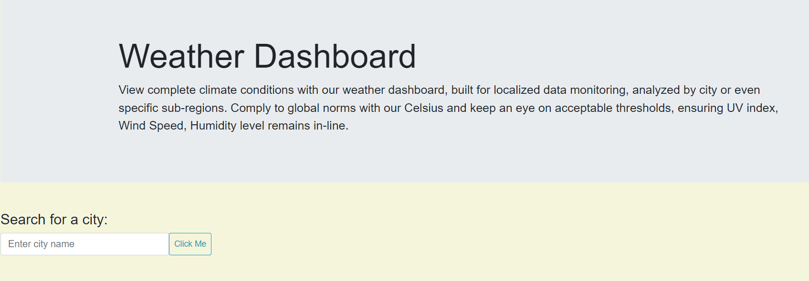
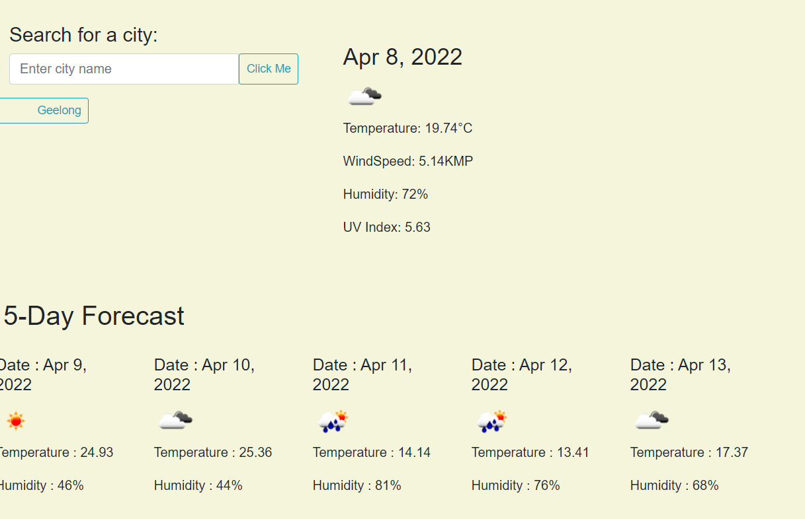

# weatherdashboard
web application to forecast current and 5 days weather forecast 

This is a weather dashboard application with form inputs that will run in the browser and feature dynamically update HTML and CSS. It allows the user to search, monitor and analyzed the weather condition not only for the city but also specific sub-regions with display in acceptable thresholds, ensuring UV index, Wind Speed and Humidity levels.

# functionality 
    * Search for a city, the current and future weather conditions for that city will be displayed and that city is added to the search history
    * search will show city name, date, an icon representation of weather conditions, temperature in celsius, humidity, wind speed and UV index.

# Web application screenshots

    
    

# Technologies and Libraries
    * HTML
    * CSS
    * Bootstrap
    * Moment.js
    * WEB API
    * Server-Side API

